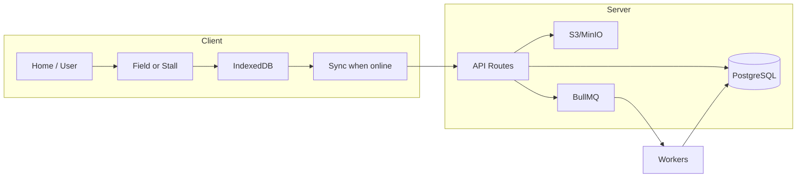
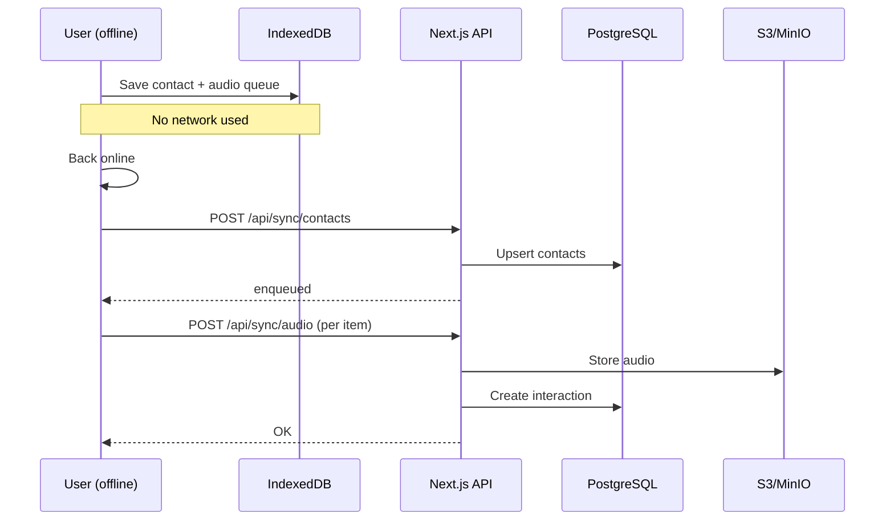

# FinBridge - Contact & Deal Management Platform

<div align="center">

**A full-stack, offline-first PWA for field capture, audio interactions, deal reviews, and follow-up management.**

[](https://nextjs.org/)
[](https://reactjs.org/)
[](https://www.typescriptlang.org/)
[](https://www.prisma.io/)
[](https://www.postgresql.org/)
[](https://tailwindcss.com/)
[](https://web.dev/progressive-web-apps/)

</div>

---

## Table of Contents

| # | Section |
|---|-------- |
| 1 | [Executive Summary](#1-executive-summary) |
| 2 | [Technology Stack](#2-technology-stack) |
| 3 | [Business & Product Overview](#3-business--product-overview) |
| 4 | [System Architecture](#4-system-architecture) |
| 5 | [User Roles & Workflows](#5-user-roles--workflows) |
| 6 | [Offline-First Design (Deep Dive)](#6-offline-first-design-deep-dive) |
| 7 | [API Reference](#7-api-reference) |
| 8 | [Data Model](#8-data-model) |
| 9 | [Analytics & Reporting](#9-analytics--reporting) |
| 10 | [Setup & Run](#10-setup--run) |

---

## 1. Executive Summary

| Metric | Description |
|--------|-------------|
| **Product** | FinBridge — Contact capture, audio notes, deal review, and follow-up management |
| **Deployment** | Web PWA (installable on mobile & desktop), Vercel-ready |
| **Offline** | Full capture and queue when offline; sync when online |
| **Roles** | User (field), Moderator (review/audio/deals), Admin (full CRUD + analytics) |
| **Stack** | Next.js 15, React 19, Prisma, PostgreSQL, MinIO/S3, BullMQ/Redis, IndexedDB |

---

## 2. Technology Stack

### 2.1 Core Technologies (with icons)

| Icon | Technology | Version | Purpose |
|:----:|-----------|--------|---------|
| ⚛️ | **React** | 19.2 | UI library |
| ▲ | **Next.js** | 15.5 | App router, SSR, API routes, Turbopack |
| 📘 | **TypeScript** | 5.x | Type safety |
| 🗄️ | **Prisma** | 6.19 | ORM, migrations, type-safe DB access |
| 🐘 | **PostgreSQL** | - | Primary database |
| 🎨 | **Tailwind CSS** | 4 | Styling, design tokens |
| 📦 | **Radix UI** | Various | Accessible components (dialogs, selects, tables) |
| 🎭 | **Framer Motion** | 12.x | Animations, page transitions |
| 📊 | **Recharts** | 2.15 | Charts (admin/moderator analytics) |
| 📋 | **React Hook Form + Zod** | 7.x / 4.x | Forms and validation |
| 🔐 | **JWT (jose + jsonwebtoken)** | 6.x / 9.x | Auth tokens, session |
| 📧 | **Nodemailer** | 7.x | SMTP (password reset, notifications) |

### 2.2 Backend & Infrastructure

| Icon | Technology | Purpose |
|:----:|-----------|---------|
| 🪣 | **AWS SDK (S3) / MinIO** | Audio file storage (object store) |
| 📮 | **BullMQ** | Job queues (transcribe, contacts sync, audio) |
| 🔴 | **Redis / Upstash** | Queue broker, optional cache |
| 📱 | **next-pwa** | Service worker, manifest, installability |
| 🗃️ | **IndexedDB (browser)** | Offline contact & interaction store (capture) |
| 🧪 | **Tesseract.js** | OCR for business card scan (optional) |

### 2.3 Development & Tooling

| Tool | Use |
|------|-----|
| **pnpm** | Package manager |
| **dotenv-cli** | Env loading for scripts (`.env`, `.env.local.dev`) |
| **tsx** | Run TypeScript scripts (workers, seeds, migrate) |
| **ESLint + Next config** | Linting |
| **Concurrently** | Run dev + workers together |

---

## 3. Business & Product Overview

### 3.1 What FinBridge Does

1. **Field capture** - Users capture leads at stalls/events (name, phone, email, interests) and optional voice notes, with or without network.
2. **Audio storage** - Audio is uploaded to S3/MinIO and linked to interactions; multiple clips per contact are supported (array of object keys).
3. **Deal review** - Moderators listen to audio, view transcripts, and mark deals as Profitable / Engaging / Worthy and add remarks.
4. **Deal list & export** - Moderators view all deal reviews in a table and can export to CSV.
5. **Admin dashboard** - Admins see site-wide analytics (users, contacts, interactions, follow-ups, deal metrics) and manage users, moderators, and contacts (CRUD).
6. **Follow-ups** - Contacts can have follow-up tasks (due date, status); workflow supports reminders and escalation (logic can be extended via cron).
7. **Sync** - Offline-captured contacts and interactions sync to the server when online; audio is queued and uploaded in batches.

### 3.2 Key Numbers (What the Platform Tracks)

| # | Metric | Source | Typical use |
|---|--------|--------|-------------|
| 1 | **Total users** | `users` table | Admin dashboard |
| 2 | **Moderators / Admins** | `users` where `role` IN (MODERATOR, ADMIN) | Role-based access |
| 3 | **Total contacts** | `contacts` table | Admin + Moderator analytics |
| 4 | **Total interactions** | `interactions` table | Engagement metrics |
| 5 | **Interactions with audio** | `interactions` where `audioObjectKeys` non-empty | Audio review queue |
| 6 | **Deal reviews settled** | `interactions` where deal fields not null | Deal completion rate |
| 7 | **Pending follow-ups** | `follow_ups` where status = Pending/Overdue | Follow-up workload |
| 8 | **Pending sync (offline)** | IndexedDB contacts/interactions with `pending_sync` | Sync status in UI |

### 3.3 Business Analytics (What the Platform Measures)

| Area | Metrics |
|------|---------|
| **Users** | Total users, moderators, admins (from `users` + `role`) |
| **Contacts** | Total contacts, by source (manual / event), pending sync count |
| **Interactions** | Total interactions, count with audio, count with deal verdicts |
| **Deals** | Deal reviews settled (profitable / engaging / worthy / remarks) |
| **Follow-ups** | Pending, completed, overdue (from `follow_ups`) |
| **Growth** | User signups over time (admin analytics) |

---

## 4. System Architecture

### 4.1 High-Level Diagram

```
┌─────────────────────────────────────────────────────────────────────────────┐
│                              CLIENT (Browser / PWA)                         │
├─────────────────────────────────────────────────────────────────────────────┤
│  ┌──────────────┐  ┌──────────────┐  ┌──────────────┐  ┌──────────────────┐ │
│  │   Home       │  │  Field /     │  │  Moderator   │  │  Admin           │ │
│  │   Landing    │  │  Stall       │  │  Audio &     │  │  Dashboard &     │ │
│  │   (Public)   │  │  Capture     │  │  Deals       │  │  CRUD            │ │
│  └──────┬───────┘  └──────┬───────┘  └──────┬───────┘  └────────┬─────────┘ │
│         │                 │                 │                   │           │
│         │                 │  ┌──────────────▼──────────────┐    │           │
│         │                 │  │  IndexedDB (Offline Store)  │    │           │
│         │                 │  │  • draft (stall/field)      │    │           │
│         │                 │  │  • contacts (local + sync)  │    │           │
│         │                 │  │  • audio_transcript_queue   │    │           │
│         │                 │  └──────────────┬──────────────┘    │           │
│         │                 │                 │                   │           │
│         └─────────────────┴─────────────────┴───────────────────┘           │
│                                    │                                        │
│                          HTTPS (when online)                                │
└────────────────────────────────────┼────────────────────────────────────────┘
                                     │
┌────────────────────────────────────▼─────────────────────────────────────────┐
│                         NEXT.JS APP (API Routes + SSR)                       │
├──────────────────────────────────────────────────────────────────────────────┤
│  Auth (JWT)  │  /api/contacts  │  /api/interactions  │  /api/sync/*          │
│  /api/auth/* │  /api/sync/     │  /api/interactions/ │  /api/moderator/*     │
│              │  contacts       │  audio              │  /api/admin/*         │
└────────────────────────────────────┬─────────────────────────────────────────┘
                                     │
         ┌───────────────────────────┼───────────────────────────┐
         │                           │                           │
         ▼                           ▼                           ▼
┌─────────────────┐       ┌──────────────────┐       ┌─────────────────────┐
│   PostgreSQL    │       │  MinIO / S3      │       │  Redis + BullMQ     │
│   (Prisma)      │       │  (Audio blobs)   │       │  (Transcribe, sync  │
│                 │       │                  │       │   workers)          │
└─────────────────┘       └──────────────────┘       └─────────────────────┘
```

### 4.2 Workflow Diagram (Mermaid)



### 4.3 Offline → Online Sync Sequence



### 4.4 Request Flow (Simplified)

| Step | Actor | Action |
|------|--------|--------|
| 1 | User | Opens Field or Stall capture page (optional: offline) |
| 2 | App | Reads/writes draft and contacts from **IndexedDB** (no server required) |
| 3 | User | Submits contact + optional audio |
| 4 | App | If **online**: POST `/api/contacts` or `/api/interactions` (with audio to S3). If **offline**: store in IndexedDB and queue for sync |
| 5 | Server | Persists contact/interaction in **PostgreSQL**, stores audio in **S3/MinIO**, may enqueue **transcribe** job |
| 6 | Worker | Picks transcribe job from **BullMQ**, calls Python/transcription service, updates interaction transcript |
| 7 | Moderator | Opens Audio / Deals pages, fetches interactions and audio URLs, submits deal verdicts via PATCH |
| 8 | Admin | Opens Admin dashboard, fetches analytics from `/api/admin/analytics`, manages users/contacts |

---

## 5. User Roles & Workflows

### 5.1 Role Matrix

| Role | Access | Main Actions |
|------|--------|--------------|
| **USER** | Home, User dashboard, Field/Stall capture | Capture contacts, record audio, sync when online |
| **MODERATOR** | Above + Moderator dashboard, Audio review, Deals, Follow-up insights | Listen to audio, mark deal verdicts, export deals CSV, view follow-up insights |
| **ADMIN** | Above + Admin dashboard, Users, Contacts, Analytics | Full CRUD on users/contacts, view site analytics, manage data |

### 5.2 Capture Workflow (Field & Stall)

| Step | Description |
|------|-------------|
| 1 | User selects **Stall** or **Field** mode from home (or user dashboard). |
| 2 | **Stall**: Single draft per device (IndexedDB). **Field**: Quick capture per contact; draft can be cleared after save. |
| 3 | User enters name, phone, email (optional), interests (Stall: intent tags). Optional: scan card (Tesseract), record voice note. |
| 4 | On **Save**: if online, POST to `/api/contacts` (and optionally `/api/interactions` with audio). If offline, data is written to IndexedDB and (for audio) to `audio_transcript_queue`. |
| 5 | Duplicate check: by phone (server) or local IndexedDB; user can “Add anyway” to create or append. |
| 6 | When back online: sync service (or worker) pushes pending contacts then interactions (and audio) to the server. |

### 5.3 Moderator Workflow (Audio & Deals)

| Step | Description |
|------|-------------|
| 1 | Moderator opens **Moderator** dashboard (cards: Audio review, Deal review, Follow-up insights, etc.). |
| 2 | **Audio review**: List interactions with audio (paginated), search; play audio, view transcript; update contact info. |
| 3 | **Deal review**: List interactions with deal fields; set Profitable / Engaging / Worthy and Remarks; Save. |
| 4 | **Export**: Download deals as CSV via `/api/moderator/deals/export/csv`. |
| 5 | **Follow-up insights**: View suggested follow-up days by lead type (from historical deal data). |

### 5.4 Admin Workflow

| Step | Description |
|------|-------------|
| 1 | Admin opens **Admin** dashboard; sees analytics cards (users, contacts, interactions, follow-ups, deals). |
| 2 | **Manage data**: Links to User management, Contact management (and optionally Moderator management). |
| 3 | **Users**: CRUD users (create, read, update, delete), role assignment. |
| 4 | **Contacts**: List/search contacts, CRUD. |
| 5 | **Analytics**: User growth chart, site-wide counts; export/insights as needed. |

---

## 6. Offline-First Design (Deep Dive)

This section explains **how the solution works offline** so that no one can “catch” the system unprepared: capture continues without the network, and data is reconciled when back online.

### 6.1 Where Offline Is Required

| Scenario | Offline behavior |
|----------|-------------------|
| **Field/Stall capture** | User can add contacts and record audio with **no network**. |
| **List of captured contacts** | Served from **IndexedDB** (no server call). |
| **Draft (current form)** | Stored in IndexedDB (`draft` store), keyed by mode (stall/field). |
| **Audio playback (already synced)** | If URLs are cached or re-fetched when online, playback works when online. |

### 6.2 Offline Data Stores (IndexedDB)

The capture module uses a single IndexedDB database: **`finbridge-capture`** (version 3).

| Store | Key | Purpose |
|-------|-----|---------|
| **draft** | `mode` (stall \| field) | Current form state: name, phone, email, intent_tags, draft_audio_queue_id, updated_at. |
| **contacts** | `local_id` | Contacts created offline or synced; fields: name, phone, email, company, intent_tags, source_mode, device_id, event_id, server_id, pending_sync, version, etc. |
| **audio_transcript_queue** | `id` | Queued audio blobs + contact_local_id, status (pending \| processing \| done \| failed), retry_count, contact_server_id (after contact sync). |

- **Device ID**: A persistent `finbridge-device-id` in `localStorage` identifies the device for sync.
- **Sync status**: Contacts and (in alternate flow) interactions are marked `pending_sync` or `synced` / `failed` with optional `last_sync_error`.

### 6.3 Offline Capture Flow (Step-by-Step)

```
[User offline]
     │
     ▼
┌─────────────────────────────────────────────────────────────────┐
│  1. User fills form (name, phone, email, interests)             │
│     → Draft saved to IndexedDB (debounced)                      │
└─────────────────────────────────────────────────────────────────┘
     │
     ▼
┌─────────────────────────────────────────────────────────────────┐
│  2. User optionally records voice note                          │
│     → Blob stored in audio_transcript_queue (pending)           │
│     → draft.draft_audio_queue_id linked to queue item           │
└─────────────────────────────────────────────────────────────────┘
     │
     ▼
┌─────────────────────────────────────────────────────────────────┐
│  3. User clicks Save                                            │
│     → Duplicate check: by phone in IndexedDB (local)            │
│     → If new: contact record created (local_id, pending_sync)   │
│     → If duplicate: "Add anyway" can create or append           │
│     → Audio queue item(s) linked to contact_local_id            │
└─────────────────────────────────────────────────────────────────┘
     │
     ▼
┌─────────────────────────────────────────────────────────────────┐
│  4. No HTTP call is made; all data is in IndexedDB              │
│     → User can continue capturing; queue grows                  │
└─────────────────────────────────────────────────────────────────┘
```

### 6.4 Sync When Back Online

Two sync strategies appear in the codebase:

**A) In-browser SyncService (`lib/sync-service.ts`)**

- Uses **Dexie** (IndexedDB wrapper) and `db.contacts` / `db.interactions` with `syncStatus`.
- **Order**: Sync contacts first (batch of 10), then interactions.
- For each contact: `POST /api/contacts` with JSON body; on success, re-map local ID to server ID if different and update all local interactions to the new `contactId`.
- For each interaction: `POST /api/interactions` with `FormData` (contact_id, optional audio_file blob). On 404 CONTACT_NOT_FOUND, parent contact is re-queued as pending.
- **Result**: Contacts and interactions are pushed to the server; audio is sent as multipart when syncing interactions.

**B) Capture sync + workers (`lib/capture-sync.ts`, `/api/sync/*`)**

- **Contacts**: `getUnsyncedContacts()` from capture DB → `POST /api/sync/contacts` with array of contacts (local_id, name, phone, email, …). Server enqueues contact upsert jobs and optionally transcribe; response includes `enqueued`, `transcribeEnqueued`. Local state is updated (e.g. `pending_sync: false`).
- **Audio**: `getPendingAudioTranscriptItems(50)` → `POST /api/sync/audio/enqueue-batch` with item ids and contact mapping, then per-item upload with `FormData` (id, contact_local_id, contact_server_id, audio blob) to `/api/sync/audio`. Server creates interaction and stores audio in S3; queue item marked done/failed.

So offline, **nothing is lost**: contacts and audio live in IndexedDB until the client (or a worker) runs sync when the network is available.

### 6.5 PWA and Installability

| Feature | Implementation |
|---------|----------------|
| **Service worker** | `next-pwa` (disabled in dev), generates `public/sw.js` and workbox config. |
| **Manifest** | PWA manifest in `public` for install prompt (name, icons, scope). |
| **Install prompt** | `PWAInstallPrompt` component: shows a bottom popup (or banner) on home after a short delay; detects standalone/Android/iOS; "Install" triggers `beforeinstallprompt` or instructions for iOS. |
| **Offline fallback** | With service worker, cached assets and routes can be served when offline so the app shell and capture UI remain usable. |

### 6.6 Why This Offline Design Is Robust

| Concern | How we handle it |
|---------|-------------------|
| **No network at event** | All capture writes go to IndexedDB first; no dependency on server during capture. |
| **Browser closed before sync** | Data remains in IndexedDB; next time the user opens the app and goes online, sync can run (manually or via worker). |
| **Duplicate contacts** | Server and local duplicate check by phone; "Add anyway" allows append (e.g. same person, new interaction). |
| **Audio never lost** | Audio is stored as Blob in `audio_transcript_queue`; sync uploads to S3 and creates interaction when online. |
| **ID mismatch after sync** | Sync service re-maps local contact ID to server ID and updates all local interactions to the new `contactId`. |
| **Partial sync failure** | Contacts sync first; if a contact fails, its interactions are skipped until the contact is fixed or re-queued. |
| **Multiple devices** | Each device has its own IndexedDB; sync is per-device; server is source of truth after sync. |

### 6.7 Summary Table: Offline vs Online

| Action | Offline | Online |
|--------|---------|--------|
| Open Field/Stall | ✅ Draft from IndexedDB | ✅ Same |
| Save contact (no audio) | ✅ Stored in IndexedDB, pending_sync | ✅ Can POST directly to `/api/contacts` |
| Record & attach audio | ✅ Stored in audio_transcript_queue | ✅ Can POST to `/api/interactions` with audio |
| List captured contacts | ✅ From IndexedDB | ✅ Can also come from server later |
| Sync pending | ❌ No network | ✅ SyncService or capture-sync + workers push to server |
| Play audio (already synced) | ❌ Usually needs URL from server | ✅ Presigned URL from `/api/interactions/audio` |
| Moderator / Admin | ❌ Needs API | ✅ All routes require auth + network |

---

## 7. API Reference

### 7.1 Auth

| Method | Path | Description |
|--------|------|-------------|
| POST | `/api/auth/login` | Login (email, password); sets JWT cookie. |
| POST | `/api/auth/signup` | Register (email, password, fullName, role). |
| POST | `/api/auth/logout` | Clear auth cookie. |
| POST | `/api/auth/forgot-password` | Send password reset email. |
| POST | `/api/auth/reset-password` | Reset password with token. |

### 7.2 Contacts & Interactions

| Method | Path | Description |
|--------|------|-------------|
| POST | `/api/contacts` | Create or upsert contact (JSON or FormData with optional audio). |
| GET | `/api/interactions/audio` | List interactions with audio (paginated), optional search; returns presigned URLs. |
| POST | `/api/interactions` | Create interaction (FormData: contact_id or phone/name/email, optional audio_file, tags). |
| GET | `/api/contacts/check-duplicate` | Check duplicate by phone. |

### 7.3 Sync (Offline → Server)

| Method | Path | Description |
|--------|------|-------------|
| POST | `/api/sync/contacts` | Bulk contact sync (array of contacts with local_id, name, phone, …). |
| POST | `/api/sync/audio/enqueue-batch` | Enqueue batch of audio queue items (ids + contact mapping). |
| POST | `/api/sync/audio` | Upload single audio blob; create interaction, store in S3. |

### 7.4 Moderator

| Method | Path | Description |
|--------|------|-------------|
| GET | `/api/moderator/deals` | List interactions (deals) with contact and creator; paginated. |
| PATCH | `/api/moderator/deals` | Update deal verdicts (dealProfitable, dealEngaging, dealWorthy, dealRemarks). |
| GET | `/api/moderator/deals/export/csv` | Export deals as CSV. |

### 7.5 Admin

| Method | Path | Description |
|--------|------|-------------|
| GET | `/api/admin/analytics` | Site analytics (users, contacts, interactions, follow-ups, deals). |
| GET/POST/PATCH/DELETE | `/api/user/*`, `/api/admin/contacts` | User and contact CRUD. |

### 7.6 Other

| Method | Path | Description |
|--------|------|-------------|
| GET | `/api/analytics/users` | User counts (total, moderators, admins). |
| GET | `/api/interactions/export/csv` | Export interactions CSV. |
| GET | `/api/diagnostic/audio` | Diagnostic info for audio/S3. |

---

## 8. Data Model

### 8.1 Entity Relationship (Summary)

| Model | Main fields | Relations |
|-------|-------------|-----------|
| **User** | id, email, fullName, password, role (USER \| MODERATOR \| ADMIN) | interactions (createdBy), passwordResetTokens |
| **Contact** | id, name, email, phone (unique), currentStage, company, intentTags, sourceMode, eventId, deviceId, offlineLocalId, pendingSync, version | interactions, followups |
| **Interaction** | id, contactId, createdBy, createdAt, audioObjectKeys[], transcript, structuredSnapshot, tags, dealProfitable, dealEngaging, dealWorthy, dealRemarks, followupStatus | contact, createdByUser, aiJobs |
| **FollowUp** | id, contactId, dueDate, status, createdAt | contact |
| **AiJob** | id, interactionId, status, retryCount | interaction |

### 8.2 Key Conventions

- **Contacts**: Identified by `phone` (unique). `offlineLocalId` links server contact to offline capture.
- **Interactions**: Multiple audio clips per interaction via `audioObjectKeys` (array of S3 keys).
- **Deal review**: Boolean flags and remarks on `Interaction`; moderators set these from the Deals page.

---

## 9. Analytics & Reporting

| Dashboard | Data source | Metrics |
|-----------|-------------|---------|
| **Moderator** | `/api/analytics/users` | Total users, moderators, admins; optional total contacts/interactions. |
| **Admin** | `/api/admin/analytics` | totalUsers, totalModerators, totalAdmins, totalContacts, totalInteractions, totalFollowUps, interactionsWithAudio, dealReviewsSettled. |
| **Admin (growth)** | `/api/analytics/user-growth` | User signups over time (for charts). |
| **Deals** | `/api/moderator/deals` + export | Table of interactions with deal fields; CSV export. |

---

## 10. Setup & Run

### 10.1 Environment Variables (Summary)

| Variable | Purpose |
|----------|---------|
| `DATABASE_URL` | PostgreSQL connection string. |
| `JWT_SECRET` | Signing key for auth tokens. |
| `SMTP_*` | Nodemailer (forgot password, notifications). |
| `MINIO_*` / S3 | Object storage for audio. |
| `REDIS_URL` / Upstash | BullMQ connection. |
| `CRON_SECRET` | Optional; secure cron endpoints. |
| `FOLLOWUP_NOTIFY_EMAIL` | Optional; email for follow-up notifications. |

Use `.env` or `.env.local.dev`; scripts use `dotenv` or `dotenv -e .env.local.dev`.

### 10.2 Commands

| Command | Description |
|---------|-------------|
| `pnpm install` | Install dependencies. |
| `pnpm prisma:generate` or `pnpm prisma:generate:local` | Generate Prisma client. |
| `pnpm prisma:migrate` or `pnpm prisma:migrate:local` | Run migrations. |
| `pnpm dev` | Start Next.js dev server. |
| `pnpm dev:local` | Start with `.env.local.dev` (e.g. port 3001). |
| `pnpm build` | Production build. |
| `pnpm start` | Start production server. |
| `pnpm worker:contacts` / `pnpm worker:audio` / `pnpm worker:transcribe` | Run background workers (contacts sync, audio, transcribe). |
| `pnpm run check-migrations` | Verify all migration directories contain `migration.sql`. |

### 10.3 Quick Start

```bash
# 1. Clone and install
git clone <repo>
cd htt_Businessmen
pnpm install

# 2. Configure env (copy .env.example to .env and set DATABASE_URL, JWT_SECRET, etc.)
cp .env.example .env

# 3. Database
pnpm prisma:generate:local
pnpm prisma:migrate:local

# 4. Run app (and optionally workers)
pnpm dev:local
# In another terminal: pnpm worker:transcribe  (if using transcription)
```

---

## Appendix: Route Map (Pages)

| Route | Access | Description |
|-------|--------|-------------|
| `/` | Public | Home (Hero, Features, Testimonials, CTA, FAQ). |
| `/login`, `/signup`, `/forgot-password`, `/reset-password` | Public | Auth. |
| `/user` | User | User dashboard (links to capture, etc.). |
| `/field`, `/stall` | User | Field and Stall capture (offline-capable). |
| `/moderator` | Moderator, Admin | Moderator dashboard (cards to Audio, Deals, etc.). |
| `/moderator/audio` | Moderator, Admin | Audio review (interactions with audio, search, play). |
| `/moderator/deals` | Moderator, Admin | Deal review table, export CSV. |
| `/moderator/follow-up-insights` | Moderator, Admin | Follow-up suggestions by lead type. |
| `/admin` | Admin | Admin entry. |
| `/admin/dashboard` | Admin | Analytics and manage data (users, contacts). |
| `/admin/users`, `/admin/contacts` | Admin | User and contact CRUD. |
| `/unauthorized` | Any | Shown when role is insufficient. |

---

<div align="center">

**FinBridge** — *Capture everywhere. Review and follow up with confidence.*

</div>
