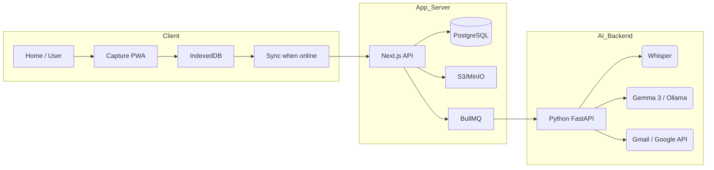

# FinBridge - Contact & Deal Management Platform

<div align="center">

**A full-stack, AI-powered, offline-first PWA for field capture, audio interactions, deal reviews, and automated follow-up management.**

[](https://nextjs.org/)
[](https://reactjs.org/)
[](https://www.typescriptlang.org/)
[](https://www.prisma.io/)
[](https://www.postgresql.org/)
[](https://tailwindcss.com/)
[](https://web.dev/progressive-web-apps/)

</div>

---

## ✨ Standout Features

### 1. 🎭 Deep Sentiment & Emotion Analysis
Beyond simple text, FinBridge performs **Multimodal Sentiment Analysis**. We use **RoBERTa (INT8-ONNX)** for high-speed text sentiment and **Wav2Vec2** for Vocal Emotion Recognition (SER). 
*   **Audio Insights**: Detect frustration, excitement, or hesitation directly from the speaker's voice.
*   **Text Context**: AI scans transcripts for financial hotspots and commitment promises.

### 2. 🗓️ Google Meet & Gmail Auto-Scheduler
The **Gmail Intelligence** layer doesn't just send emails—it understands intent.
*   **Intent Detection**: AI classifies email replies to detect if a lead wants to meet.
*   **One-Click Scheduling**: Automatically generates **Google Meet** links and calendars invites directly from the moderator dashboard.
*   **Follow-up Automation**: Personalized, AI-generated follow-up emails based on conversation context.

### 3. ⏱️ Interactive Timestamped Audio & Transcripts
The **Smart Audio Player** is seamlessly integrated with AI-generated transcripts.
*   **Jump to Intent**: Click any sentence in the transcript to jump to that exact millisecond in the audio.
*   **Hotspot Nav**: Important business intelligence moments (financials, dates, products) are automatically highlighted on the audio timeline for rapid review.

---

## Table of Contents

| # | Section |
|---|-------- |
| 1 | [Executive Summary](#1-executive-summary) |
| 2 | [Technology Stack](#2-technology-stack) |
| 3 | [Business & Product Overview](#3-business--product-overview) |
| 4 | [System Architecture](#4-system-architecture) |
| 5 | [User Roles & Workflows](#5-user-roles--workflows) |
| 6 | [Offline-First Design (Deep Dive)](#6-offline-first-design-deep-dive) |
| 7 | [API Reference](#7-api-reference) |
| 8 | [Data Model](#8-data-model) |
| 9 | [Analytics & Reporting](#9-analytics--reporting) |
| 10 | [Setup & Run](#10-setup--run) |

---

## 1. Executive Summary

| Metric | Description |
|--------|-------------|
| **Product** | FinBridge — Contact capture, audio notes, deal review, and follow-up management |
| **Deployment** | Web PWA (installable on mobile & desktop), Vercel-ready |
| **Offline** | Full capture and queue when offline; sync when online |
| **Roles** | User (field), Moderator (review/audio/deals), Admin (full CRUD + analytics) |
| **Stack** | Next.js 15, React 19, Prisma, PostgreSQL, MinIO/S3, BullMQ/Redis, IndexedDB |

---

## 2. Technology Stack

### 2.1 Core Technologies

| Icon | Technology | Version | Purpose |
|:----:|-----------|--------|---------|
| ⚛️ | **React** | 19.2 | UI library |
| ▲ | **Next.js** | 15.5 | App router, SSR, API routes, Turbopack |
| 📘 | **TypeScript** | 5.x | Type safety |
| 🗄️ | **Prisma** | 6.19 | ORM, migrations, type-safe DB access |
| 🐘 | **PostgreSQL** | - | Primary database |
| 🎨 | **Tailwind CSS** | 4 | Styling, design tokens |
| 📦 | **Radix UI** | Various | Accessible components |
| 🎭 | **Framer Motion** | 12.x | Animations, page transitions |
| 📊 | **Recharts** | 2.15 | Charts (analytics) |
| 🔐 | **JWT (jose)** | 6.x | Auth tokens, session |

### 2.2 AI & Infrastructure

| Icon | Technology | Purpose |
|:----:|-----------|---------|
| 🎙️ | **Whisper (Fast)** | Speech-to-text transcription engine |
| 🧠 | **Gemma 3 (Ollama)** | LLM for OCR, summarization, and RAG strategy |
| 📈 | **ONNX / RoBERTa** | High-speed text sentiment analysis |
| 📧 | **Google Workspace** | Gmail intent detection & Google Meet scheduling |
| 🪣 | **MinIO / S3** | Audio file storage (object store) |
| 📮 | **BullMQ / Redis** | Job queues (transcribe, contacts sync, audio) |
| 🗃️ | **IndexedDB** | Offline contact & interaction store (Dexie) |

---

## 3. Business & Product Overview

### 3.1 What FinBridge Does

1. **Field capture** - Users capture leads at stalls/events and optional voice notes, with or without network.
2. **Audio Intelligence** - Multi-clip audio storage with automated transcription, sentiment analysis, and timestamped navigation.
3. **Automated Follow-ups** - AI detects intent in email replies and auto-schedules Google Meet appointments.
4. **Deal review** - Moderators listen to audio, view AI summaries, and mark deals as Profitable / Engaging / Worthy.
5. **Strategic Simulation** - RAG-based call simulation to predict objections and suggest tactical sequences.
6. **Sync** - Offline-captured contacts and interactions sync to the server when online.

### 3.2 Key Numbers (What the Platform Tracks)

*   **Total users / roles** (User, Moderator, Admin)
*   **Total contacts** and lead source (Manual / Event)
*   **Total interactions** with audio and deal verdicts
*   **Pending follow-ups** and overdue tasks
*   **Sync status** (IndexedDB vs Server)

---

## 4. System Architecture

### 4.1 Hybrid Cloud Diagram



---

## 5. User Roles & Workflows

| Role | Access | Main Actions |
|------|--------|--------------|
| **USER** | Home, Dashboard, Capture | Capture contacts, record audio, sync when online |
| **MODERATOR** | Above + Audio/Deals | review audio, mark deal verdicts, schedule Meets, export CSV |
| **ADMIN** | Above + Admin Dashboard | Site-wide analytics, User/Contact CRUD, full data management |

---

## 6. Offline-First Design (Deep Dive)

FinBridge uses a **Dexie (IndexedDB)** layer to ensure no data is lost in high-density, low-network environments like expo stalls.

*   **Draft Store**: Persists current form state during capture.
*   **Audio Queue**: Stores raw audio blobs locally until a stable connection is detected.
*   **Conflict Resolution**: Uses a versioned sync approach to map local IDs to server IDs.

---

## 7. API Reference

| Method | Path | Description |
|--------|------|-------------|
| POST | `/api/auth/*` | Login, Signup, Forgot/Reset Password |
| POST | `/api/contacts` | Create or upsert contact (JSON or FormData) |
| GET | `/api/interactions/audio` | List interactions with audio + presigned URLs |
| PATCH | `/api/moderator/deals` | Update deal verdicts and remarks |
| POST | `/api/sync/contacts` | Bulk contact sync from IndexedDB |
| POST | `/api/google/schedule` | Auto-generate Google Meet and send invites |

---

## 8. Data Model

*   **User**: id, email, fullName, role
*   **Contact**: name, phone (unique), currentStage, intentTags, sourceMode
*   **Interaction**: audioObjectKeys[], transcript, sentiment, dealFields, followupStatus

---

## 9. Analytics & Reporting

*   **Moderator Dashboard**: Real-time interaction counts and deal progress.
*   **Admin Dashboard**: User growth charts, site-wide metrics, and data integrity checks.
*   **Export**: Full CSV support for deal reviews and contact lists.

---

## 10. Setup & Run

### 10.1 Environment Configuration
Copy `.env.example` and set:
*   `DATABASE_URL`, `JWT_SECRET`, `PYTHON_BACKEND_URL`
*   `GOOGLE_CLIENT_ID`, `GOOGLE_CLIENT_SECRET` (for Meets)
*   `WHISPER_MODEL`, `OLLAMA_HOST` (for AI features)

### 10.2 Commands
```bash
pnpm install
pnpm prisma:migrate:local
pnpm dev
# Start AI Backend
cd python_backend && python main.py
```

---

<div align="center">

**FinBridge** — *Capture everywhere. Review and follow up with confidence.*

</div>
